layout: true
  

`r paste0("
", params$event, " 

")` 

---

class: center, middle

Find those slides online : https://gidoin.github.io/enalocalgov/civicgovtech.html

Sources : https://github.com/Gidoin/enalocalgov/

This production is freely reusable under the terms of the licence  [Creative Commons 4.0 BY-SA](https://creativecommons.org/licenses/by-sa/4.0/legalcode.fr).

 
 

.center[] 

---
## What we already covered

.red[**Day 1 - Monday 07/01 2-5pm : OpenGov & local innovations**]
- **Open Government** : principles and mechanisms
- 1st pillar : **Transparency**
- 2nd pillar : **Participatory democracy**
- 3rd pillar : **accountability**

--

## What we are going to cover

.red[**Day 5 - Friday 07/05 9.30am-1pm : Civic & Gov tech**]
- Civic & Gov tech : focus on French & European ecosystems
- Visit of "Les halles civiques" & "Démocratie Ouverte" association
- Wrap-up lunch with Démocratie Ouverte experts

---
class: inverse, center, middle

# Back on track !

---

## What does Civic Tech mean ?

.center[]

---

## What does Civic Tech mean ?

> .red[**Civic Tech**] deals with Technology that enables engagement, participation or enhances the relationship between the people and government by enhancing citizen communications and public decision, improving government delivery of service, and infrastructure

--

## What about Gov Tech ?

--

> .red[**Gov Tech**] includes a wide range of technologies provided to governments to increase the efficiency of their internal operations

---

## Civic vs Gov Tech 

.center[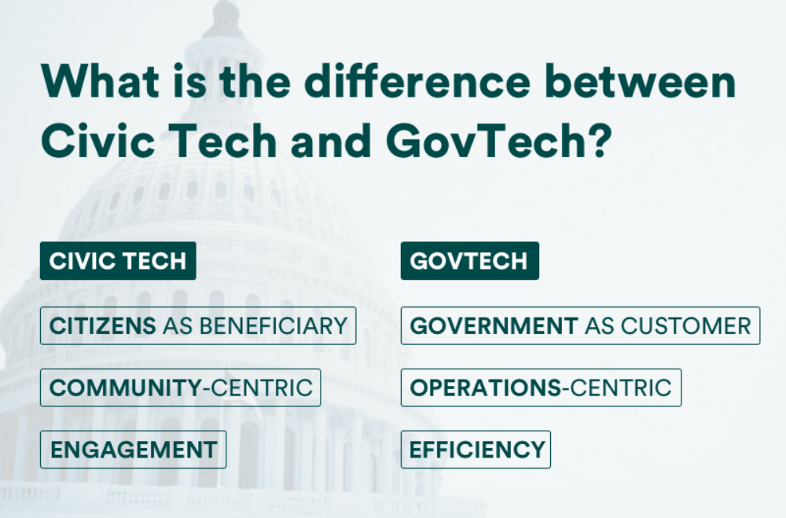]

---

## Open Source vs Proprietary

Many Civic & Gov Tech have a .red[*SaaS* business model], meaning that they sell the use of their software to professional customers (local gov, companies, associations..), often on a monthly basis. Those actors own the code of their software and aren't willing to open it, since they earn revenues through it.
Example : **Cap Collectif**

.center[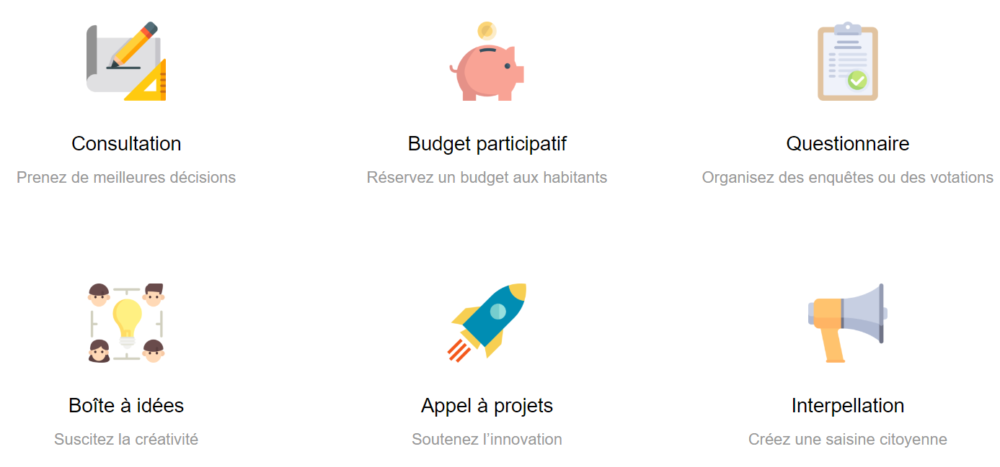]

---

## Open Source vs Proprietary

On the contrary, some Civic Tech actors opt to "free" the code source - that is called **open source** - in order to let everyone reuse it, improve it (through a community) or customize it (add some features, change the design...).
Example : [**Decidim**](https://decidim.org/)

.center[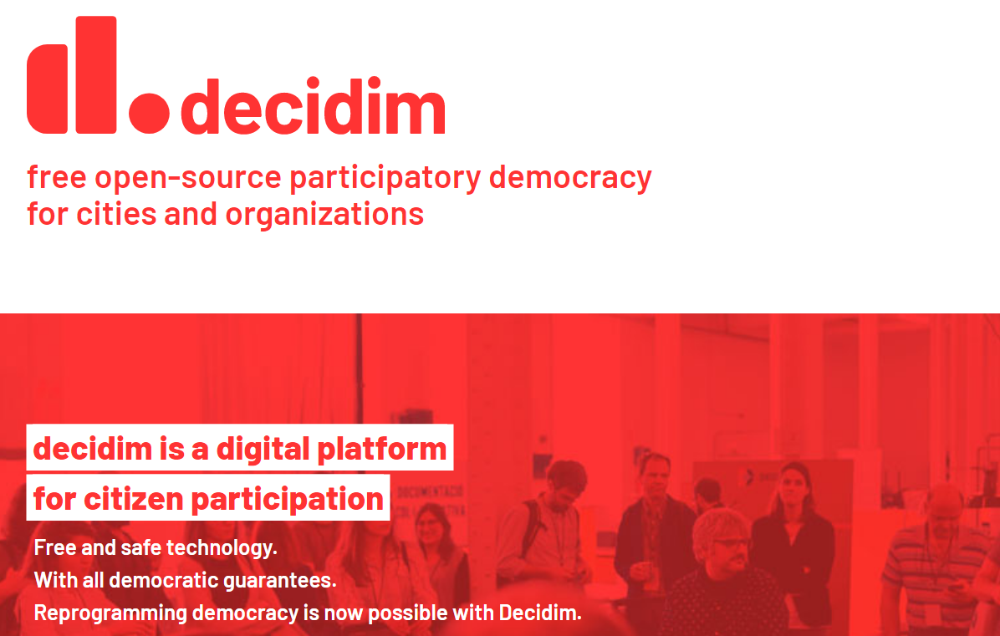]

---

## Open Source vs Proprietary

.center[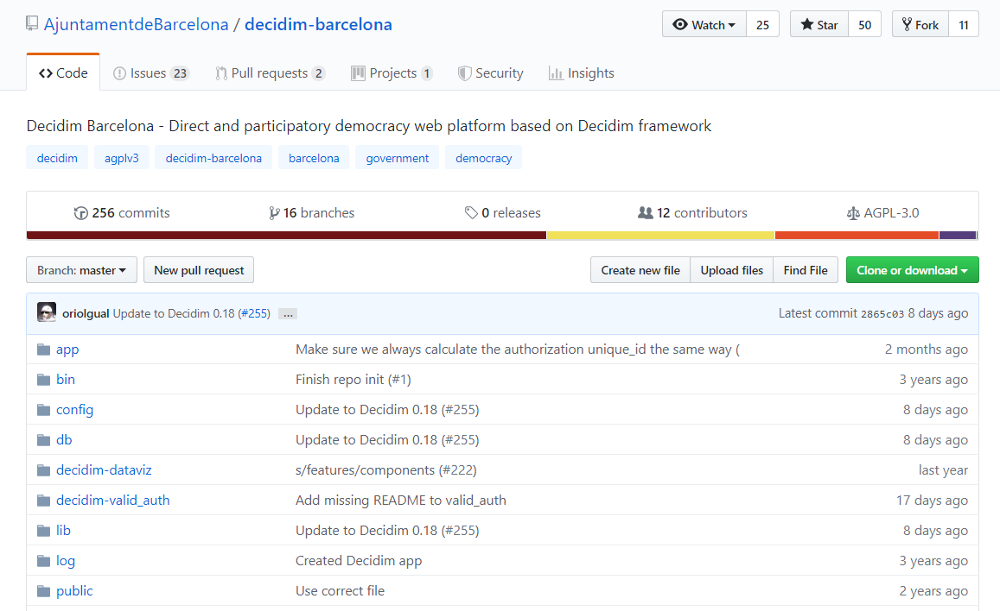]

---

## Open Source vs Proprietary

According to you, how can those actors be sustainable in the long run ?

--

- Through a **commited community** that supports financially the projet (recurrent donations). Ex: [Captain Fact](https://captainfact.io/)

- Through **paid prestations** such as helping organizations to install their own version of the software + maintenance 

Some tensions may exist between proprietary and open source actors

---

## Open Source vs Proprietary

.center[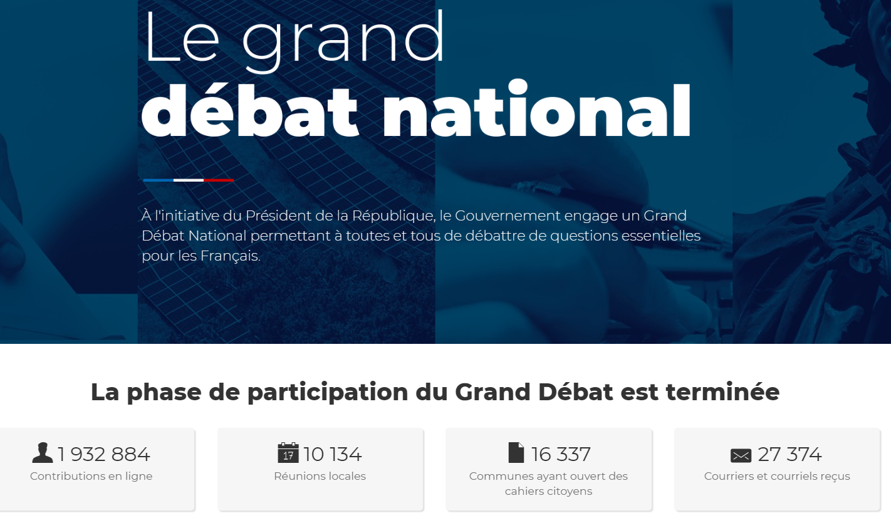]

---

## Open Source vs Proprietary

.center[]

---

class: inverse, center, middle

## Should Civic tech be supported financially by the government ?

---

## OpenDataSoft

A good exemple of a French Gov Tech that is successful and with a lucrative Saas business model : they develop and host open data platforms.

.center[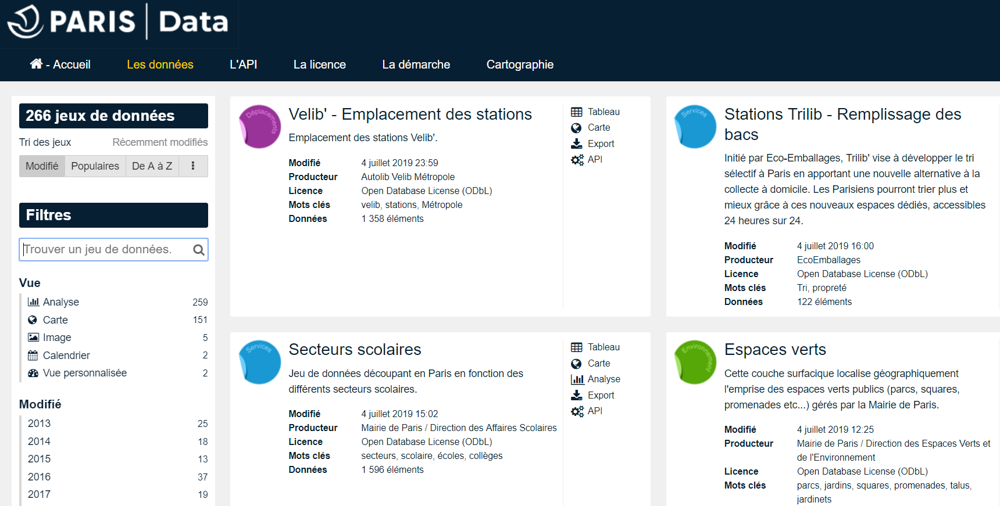]

In France, Open Data has become mandatory end of 2016 and most of public agencies (> 50 civil servants) and local authorities (> 3000 inhabitants) have to open their data by default (it's not an option). This legislative "constraint" created a clear business opportunity that OpenDataSoft managed to grasp substantially

---

## TicTech

.center[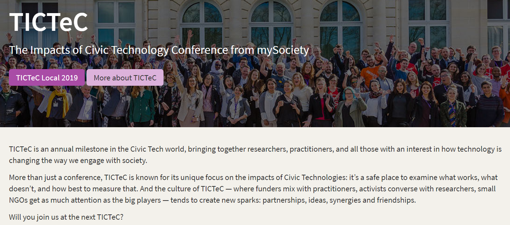]

.footnote[[Browse Tictec website](https://tictec.mysociety.org/)]

---

## TicTech

TICTeC Local is the annual conference from mySociety that focuses directly on the **use of Civic Tech in communities and local government.**

.center[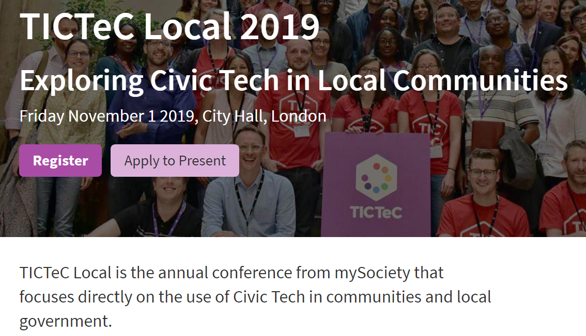]

.footnote[[Tictec wrap-up report on last TicTec local event](https://www.mysociety.org/2018/11/07/tictec-local-wrap-up-report/)]

---

## TicTech

.center[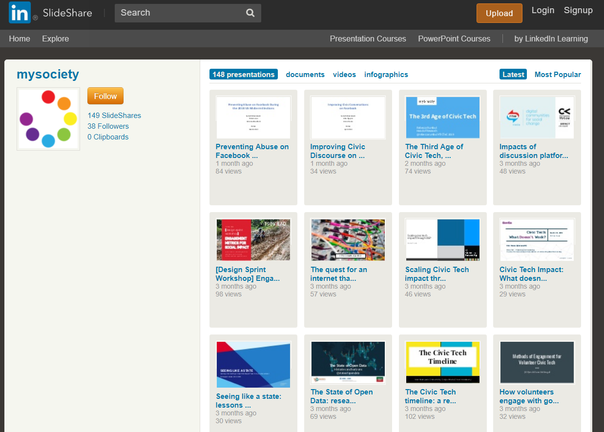]

.footnote[[Tictec ressources on Civic Tech](https://www.slideshare.net/mysociety/presentations)]

---

## SciencesPo Policy Lab

> The laboratory for public innovation is an open, participative space where students can show their inventive side and carry out professional projects. The goal is to prepare students to act responsibly for the common good. Students will brainstorm fresh ways of thinking about complex political questions, so as to create concrete solutions

.center[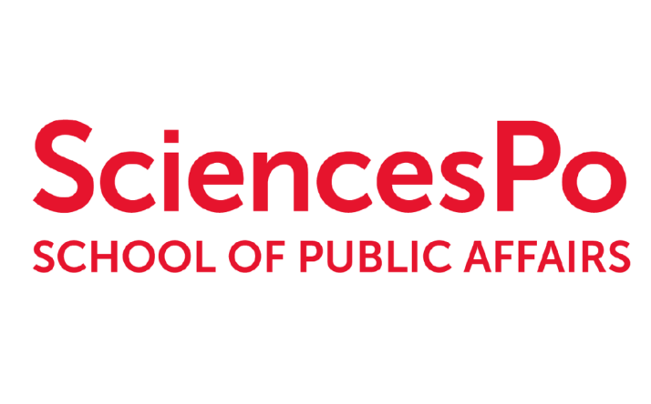]

---

## Vulekamali

.center[]

.footnote[[Vulekamali website](https://vulekamali.gov.za/)]

---

## Vulekamali

.center[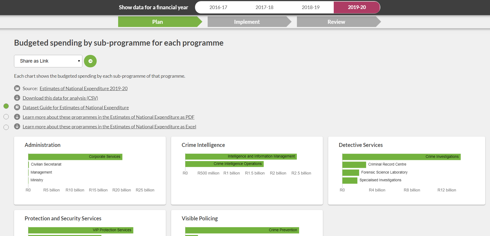]

.footnote[[Vulekamali website](https://vulekamali.gov.za/)]

---

## Vulekamali

.center[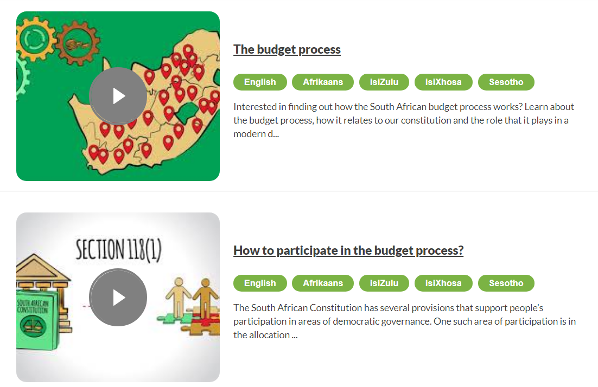]

.footnote[[Vulekamali website](https://vulekamali.gov.za/)]

---

## Other ressources for SA

You can find a list of many SA Civic tech initiatives through **Civic Tech Innovation Network** :

.center[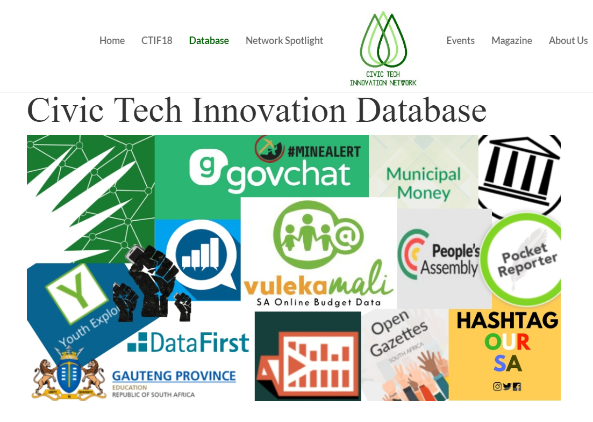]

.footnote[[The full list of Civic Tech in SA](https://civictech.africa/database/)]

---
## Let's lunch !

Reservation at Les mésanges at 12.00am

.center[]

---

class: inverse, center, middle

# Thank you !

Contact : [timothee@datactivi.st](mailto:timothee@datactivi.st)