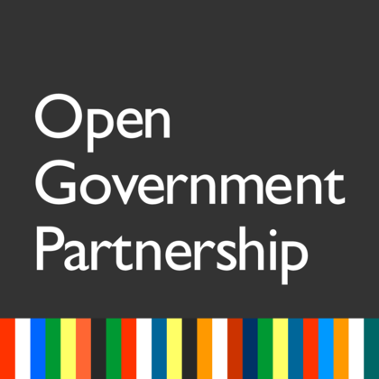
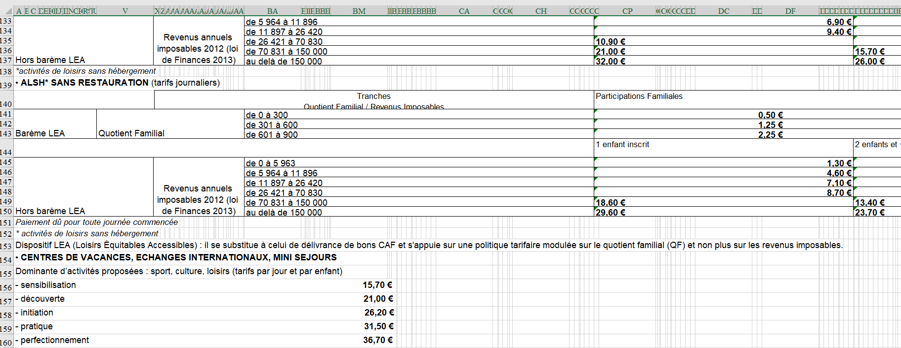

layout: true
  

`r paste0("
", params$event, " 

")` 

---

class: center, middle

Find those slides online : https://gidoin.github.io/enalocalgov/opengov.html

Sources : https://github.com/Gidoin/enalocalgov/

This production is freely reusable under the terms of the licence  [Creative Commons 4.0 BY-SA](https://creativecommons.org/licenses/by-sa/4.0/legalcode.fr).

 
 

.center[] 
---

## Who are we ?

    

### We .red[open data], we make them .red[useful]

---
## Who are we ?

- Datactivist is an .red[**open data pure player**] founded in 2016 by Samuel Goëta and Joël Gombin 

- Consulting on .red[**open data strategies**] : we help public actors to design and implement their open data strategy 

- .red[**Assistance on open data usages**] : we help public actors to find relevant usages for their open data

- .red[**Data awareness**] : we train public executives and elected representatives to gain a general culture on data through formations to open data and data science

- .red[**Data mediation**] : we organize hackathons, open data camps, data expeditions...

Data mediation is fundamentally a question of **community management** : that's why we animate the French open data community [#TeamOpenData](https://teamopendata.org).

---
## Who am I ?

.center[]
.center[[**Timothée Gidoin**](https://www.linkedin.com/in/timoth%C3%A9e-gidoin-49518880/)]
.center[[*Twitter: @TGidoin*](https://twitter.com/Tgidoin)]

- [**Datagora**](www.datagora.fr) cofounder
- Open Data consultant at .red[**Datactivist**]
- Lecturer at Sciences Po Paris and Sciences Po Saint-Germain
- Open Government consultant (**.red[Expertise France]**)

---
class: inverse, center, middle

## And you, who are you ?

---
## What we are going to cover

.red[**Day 1 - Monday 07/01 2-5pm : OpenGov & local innovations**]
- **Open Government** : principles and mechanisms
- 1st pillar : **Transparency**

*Coffee break :3.30pm*

- 2nd pillar : **Participatory democracy**
- 3rd pillar : **accountability**

**Public innovation** is transverse to those 3 pillars

.red[**Day 5 - Friday 07/05 10am-1pm : Civic & Gov tech**]
- Civic & Gov tech : focus on French & European ecosystems
- Visit of "Les halles civiques" & "Démocratie Ouverte"
- Wrap-up lunch with Démocratie Ouverte experts

---
class: inverse, center, middle

# Open Government ?

---

## What does Opengov mean ?

.center[]

---

## A definition of Opengov

> The OECD defines open government as a culture of governance based on innovative and sustainable public policies and practices inspired by the principles of .red[**transparency, accountability and participation**] that **fosters democracy and inclusive growth**

.center[]

.footnote[[OECD report](https://read.oecd-ilibrary.org/governance/open-government_9789264268104-en#page1)]

---

## A definition of Opengov

.center[]

.footnote[[Source: Démocratie Ouverte](https://fr.wikipedia.org/wiki/Gouvernement_ouvert#/media/Fichier:D%C3%A9mocratie_Ouverte.png)]

---

## A definition of Opengov

.red[**Transparency**]
- *Ouvrir les données* : Open Data
- *Faire de la pédagogie* : being pedagogical
- *Permettre le suivi des politiques* : follow-up of public policies

.red[**Participation**]
- *Consulter les citoyens* : consult the citizens
- *Organiser des débats publics* : Organize public debate
- *Co-construire les politiques* : co-plan public policies with citizens

.red[**Collaboration**]
- *Casser les silos* : break silos between administrations
- *Travailler en transversalité* : work by being agile
- *Organiser des partenariats* : organize partnerships with civil society

---

## A definition of Opengov

OpenGov aims at improving the efficiency and the responsibility of public governance. It affects both national and local authorities.

Three key pillars of Opengov:

1/ Transparency

2/ Accountability

3/ Public participation

The Opengov movement and ideas really increased in the last 10 years, notably through the support of a transnational actor...

--

The **Open Government Partnership** aka OGP

---

## Open Government Partnership

.center[] 

In September 2011, a multilateral partnership has been created so as to promote the Open Gov principles and to translate them into concrete public policies : it's called **Open Government Partnership** (OGP)

Initially founded by 8 countries ( Brazil, Indonesia, Mexico, Norway, Philippines, United Kingdom, the USA and... **South Africa** !), now OGP is composed of more than 70 countries, including France

---
## Open Government Partnership

How does OGP work ?

--

To join OGP, a contry has to be coopted by other civil society actors (for instance NGO such as Amnesty International) that testify the goodwill of the government

Once joined, the country has to write, by consulting civil society, a 2-years **national action plan** in which many **commitments** are exposed. Those public commitments have to relate with at least one of the 3 key OGP value : information transparency, public participation, accountability of public action

For instance :
+ Developing a participatory budget representing X % of total budget of a local authority

+ Implement an open data strategy that allows to open key datasets 

+ Consult citizens in the wake of a new project law

---
## Open Government Partnership

.center[]

.footnote[[Read South Africa 3rd National Action Plan (2016-2018)](https://www.opengovpartnership.org/wp-content/uploads/2019/06/South-Africa_NAP_2016-2018.docx)]

---

## Open Government Partnership

Those commitments are then audited by **independent experts and researchers (.red[IRM])** both on the way they were designed/written and on their state of progress

.center[]

.footnote[[Read South Africa End-of-Term IRM Report 2016-2018](https://www.opengovpartnership.org/wp-content/uploads/2019/06/South-Africa_NAP_2016-2018.docx)]

---

## OGP and local gov

In 2016, OGP OGP launched the “Subnational Government Pilot Program”

> This decision recognized that many open government innovations and reforms are **happening at the local level** where governments can engage more directly with citizens and many crucial public services are delivered

The Pilot program consisted of 15 “pioneer” subnational governments who signed onto the Open Government Subnational Declaration and submitted their first Action Plans.

Then in 2018, OGP supported the launch of a global Community of Practice on Transparency and Local Open Government within the United Cities and Local Governments (UCLG)

> This Community of Practice will support peer learning, networking, and wider awareness and capacity development on open governance and public integrity at the local level. 

---

## OGP and local gov

There are currently 20 members in the OGP Local Program. 
> Representing over 74 million citizens, OGP Local members are spread across all regions and illustrate the diversity in types of local governments.

.center[]

---

class: inverse, center, middle

# 1st pillar : transparency

---
class: inverse, center, middle

# Open data principles

---
class: middle, center

## 1. Completeness

--

#### Datasets released by the government should be as complete as possible, .red[reflecting the entirety of what is recorded] about a particular subject. 

#### All raw information from a dataset should be released to the public, .red[except to private information] and information that may be sensitive for .red[national safety]

---
class: middle, center

## 2. Primacy / Raw data

--

####  Datasets released by the government should be .red[primary source data]

---
class: middle, center

## 3. Timely data

--

#### Datasets released by the government should be available to the public .red[as soon as possible]

---
class: middle, center

##  4. Ease of Physical and Electronic Access

--

#### Datasets released by the government should be as accessible as possible, with accessibility defined as .red[the ease with which information can be obtained], whether through physical or electronic means

---
class: middle, center

## 5. Machine readability

--

####  Machines can handle certain kinds of inputs much better than others. Information shared in the widely-used PDF format, for example, is very difficult for machines to parse

#### Thus, information should be stored in widely-used file formats that easily lend themselves to machine processing.

---
class: middle, center

## 6. Non-discriminatory access to data

--

#### “Non-discrimination” refers to who can access data and how they must do so

#### Non-discriminatory access to data means that .red[any person can access the data at any time without having to identify him/herself] or provide any justification for doing so.

---
class: middle, center

## 7. Open standards

--

#### Open standards refer to who owns the format in which data is stored

Do you know a widespread proprietary format ?

--

#### Microsoft .red[Excel] is a fairly commonly-used spreadsheet program which costs money to use. Freely available alternative formats often exist by which stored data can be accessed without the need for a software license

---

## 8. Open Licence 

--

#### Maximal openness includes clearly .red[labeling public information] as a work of the government and .red[available without restrictions on use] as part of the public domain

#### In France two type of licences : .red[Licence Ouverte (CC-BY)] ou .red[ODBL (CC-BY-SA)]. what is the difference ?

- **LO (from Etalab) / ODBL** : with both you can share, edit the database, create derived products and had a commercial usage

- **LO** : more "permissive" : you just have to mention the source and the date of update

- **ODBL** : you have to share and open your database at the same conditions

---
## Open Data : to go further

Find [the 8 principles of Open Government Data](https://public.resource.org/8_principles.html) that were adopter in Sebastopol December 2007

.center[]

Then in 2010 this list was slightly completed and updated ([10 principes](https://sunlightfoundation.com/policy/documents/ten-open-data-principles/)) by the Sunlight Foundation.

In 2013 the Sunlight Foundation wrote instructions and recommandations to implement concretely Open Data (["Open Data guidelines"](http://sunlightf.wpengine.com/wp-content/uploads/2016/09/OpenDataGuidelines_v3.pdf)) based on those 10 principles

---
class:inverse, middle, center
# Open Data in the real life

---
## Challenge 1 : data findability

> Data findability is a major challenge. We have data portals and registries, but government agencies under one national government still publish data in different ways and different locations.(…)
**Data findability is a prerequisite for open data to fulfill its potential and currently most data is very hard to find.** 

.center[]

.footnote[https://index.okfn.org/insights/]

---
## Challenge 1 : data findability

---

## Challenge 1 : data findability

According to you, how can we improve data findability ?

--

**it is necessary to document/fill properly the metadata**, that is to say the descriptive data associated to a dataset. For instance :

--

+ Data producer
+ Date of first publication
+ Update frequency
+ Date of last update
+ Description of the dataset
+ Variables explanation
+ Topics / tags
+ Time and space coverage (year, area, segmentation)

(*This list is not exhaustive*)

---

## Challenge 1 : data findability

Summer 2017, Datactivist realized a census of all the datasets opened by 15 major French cities (Paris, Lyon, Lille, Nantes...). More than 400 datasets were listed but identifying them was not easy at all...

.center[] 

.footnote[[Medium article](https://medium.com/datactivist/qui-a-ouvert-quoi-le-recensement-des-donn%C3%A9es-des-villes-est-maintenant-ouvert-b7f697135c1f)]

---

## Challenge 1 : data findability

Thus,
> ** Half of the descriptions of data opened by local authorities were written with less than 180 caracters** and only 4% of the datasets had a description abova 1000 caracters

Beyond very short descriptions, another challenge is to **detail the name of the variables**. Often they contain acronyms that make sense for public agents but can't be understood by common citizens.

In the exemple next slide, [l'enquête Etic du Ministère de l'éducation nationale](https://data.education.gouv.fr/explore/dataset/fr-en-etic_1d/table/), many columns have labeled hardly readable such as "SiEquipementInf" ou "Maint_PersEducHEcole" but the data producer made the effort to detail each of them in the metadata

---

## Challenge 1 : data findability

.center[]

---

## Challenge 1 : data findability

.center[]

---

## Challenge 1 : data findability

.center[]

---
## Challenge 2 : data quality

> **Government data is usually incomplete, out of date, of low quality, and fragmented.** In most cases, open data catalogues or portals are manually fed as the result of informal data management approaches. **Procedures, timelines, and responsibilities are frequently unclear among government institutions tasked with this work.**

OpenDataBarometer ?

> It's a global measure of how governments are publishing and using open data for accountability, innovation and social impact. The Leaders Edition looks at the 30 governments that have adopted the Open Data Charter and those that, as G20 members, have committed to G20 Anti-Corruption Open Data Principles.

.footnote[http://opendatabarometer.org/4thedition/report/]

---
## Challenge 2 : data quality

---
## Challenge 2 : data quality

.footnote[[OpenDataBarometer 2017 ranking](https://opendatabarometer.org/?_year=2017&indicator=ODB)]

---
## Open Data example : road accidents

.center[]
---
## Open Data reutilisation : road accidents

.center[]

---
## Open Data reutilisation : road accidents

.center[]

.footnote[[Map by Joël Gombin in Marsactu](https://joelgombin.github.io/marsactu_accidents/chronique.html)]

---
## Open Data example : sanitary inspections

.center[]

.footnote[[Résultats des contrôles officiels sanitaires : dispositif d'information « Alim’confiance »](https://www.data.gouv.fr/fr/datasets/resultats-des-controles-officiels-sanitaires-dispositif-dinformation-alimconfiance/)]
---
## Open Data reutilisation : sanitary inspections

.center[]

.footnote[[26 établissements au niveau d'hygiène à corriger de manière urgent ](https://dgal.opendatasoft.com/explore/embed/dataset/export_alimconfiance/map/?disjunctive.app_libelle_activite_etablissement&disjunctive.filtre&refine.synthese_eval_sanit=A%20corriger%20de%20mani%C3%A8re%20urgente&location=6,47.24195,5.00977&static=false&datasetcard=true)]

---
## Open Data example : crime data

.center[]

---

class:center, middle, inverse
## Coffee break : 5 minutes

---

## Défi 2 : le problème de la qualité

>**Les données gouvernementales sont généralement incomplètes, obsolètes, de mauvaise qualité et fragmentées.** Dans la plupart des cas, les catalogues de données ouverts ou les portails sont alimentés manuellement à la suite d'approches informelles de gestion des données. **Les procédures, les délais et les responsabilités sont souvent peu clairs** parmi les institutions gouvernementales chargées de ce travail.

.center[] 

.footnote[http://opendatabarometer.org/4thedition/report/]

---

## Défi 2 : le problème de la qualité

Des données parfois très très agrégées...

.center[]

---
## Défi 2 : le problème de la qualité

Ou très difficilement exploitables...

.center[] 

.footnote[[Source](https://medium.com/datactivist/qui-a-ouvert-quoi-le-recensement-des-donn%C3%A9es-des-villes-est-maintenant-ouvert-b7f697135c1f)]

---
## Défi 2 : le problème de la qualité

Ou très difficilement exploitables...

.center[] 

.footnote[[Source](https://medium.com/datactivist/qui-a-ouvert-quoi-le-recensement-des-donn%C3%A9es-des-villes-est-maintenant-ouvert-b7f697135c1f)]

---

class:inverse, middle, center
## Connaissez-vous des plateformes open data ?
--

## Quels jeux de données utilisez-vous ?

---
## Data.gouv.fr ?

Data.gouv est la plateforme nationale ouverte des données publiques françaises.
Elle a été conçue et inaugurée en 2011, par la mission Etalab, puis refondue en 2013.

.center[] 

On y trouve des milliers de jeux de données, provenant principalement de producteurs publics (Ministère de l'intérieur, Agence française de développement, Insee, Ville de Paris, Région Bretagne, CNIL...) mais aussi de producteurs tiers (OpenStreetMap, OpenFoodFacts...)

---
## Au-delà de data.gouv.fr

Data.gouv.fr est la plateforme **nationale** d'open data mais ce n'est pas la seule plateforme publique qui met à disposition des données ouvertes. Il existe :

+ Des plateformes open data gérées par les **collectivités territoriales**. Par exemple, [Paris Data](https://opendata.paris.fr/explore/?sort=modified), [la Région Occitanie](https://data.laregion.fr/pages/accueil/), [l'agglomération de Saint-Malo](https://data.stmalo-agglomeration.fr/page/accueil/)...

+ Des plateformes open data gérées par des **ministères**. Exemple : [data.education.gouv.fr](https://data.education.gouv.fr/pages/accueil/)

+ Des plateformes open data gérées par des **entreprises**. Exemple [DataNova](https://datanova.laposte.fr/page/accueil/) (La Poste)

+ Des jeux de données directement publiés sur le site des producteurs de données, sans plateforme dédiée. Exemple : Insee

---
##Exemple de données ouvertes : les accidents de la route
.reduite[.center[]]

---

## Exemple de données ouvertes : les contrôles sanitaires

.reduite2[.center[]]
.footnote[[Résultats des contrôles officiels sanitaires : dispositif d'information « Alim’confiance »](https://www.data.gouv.fr/fr/datasets/resultats-des-controles-officiels-sanitaires-dispositif-dinformation-alimconfiance/)]

---

## Exemple de données ouvertes : les contrôles sanitaires

.reduite2[.center[]]
.footnote[[26 établissements au niveau d'hygiène à corriger de manière urgente ](https://dgal.opendatasoft.com/explore/embed/dataset/export_alimconfiance/map/?disjunctive.app_libelle_activite_etablissement&disjunctive.filtre&refine.synthese_eval_sanit=A%20corriger%20de%20mani%C3%A8re%20urgente&location=6,47.24195,5.00977&static=false&datasetcard=true)]

---

## Exemple de données ouvertes : autorisations de terrasses

.reduite2[.center[]]
.footnote[[Etalages et terrasses](https://opendata.paris.fr/explore/dataset/etalages-et-terrasses/map/?disjunctive.libelle_type&disjunctive.red_profession&location=18,48.87183,2.30196&basemap=jawg.streets)]

---

class: inverse, center, middle

# Merci !

Contact : [timothee@datactivi.st](mailto:timothee@datactivi.st)